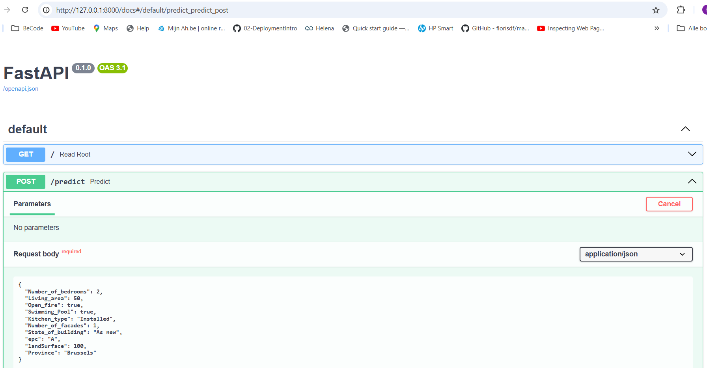
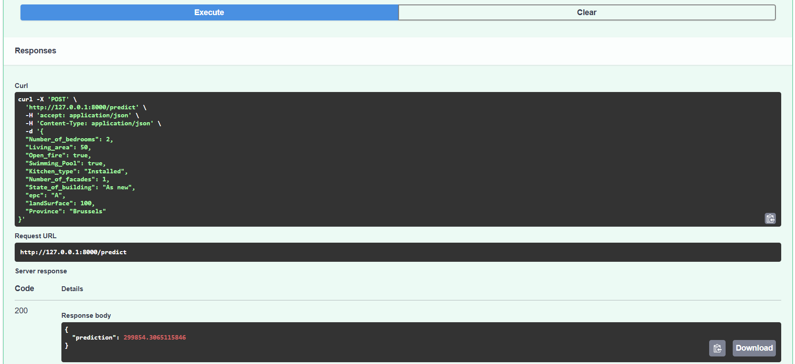
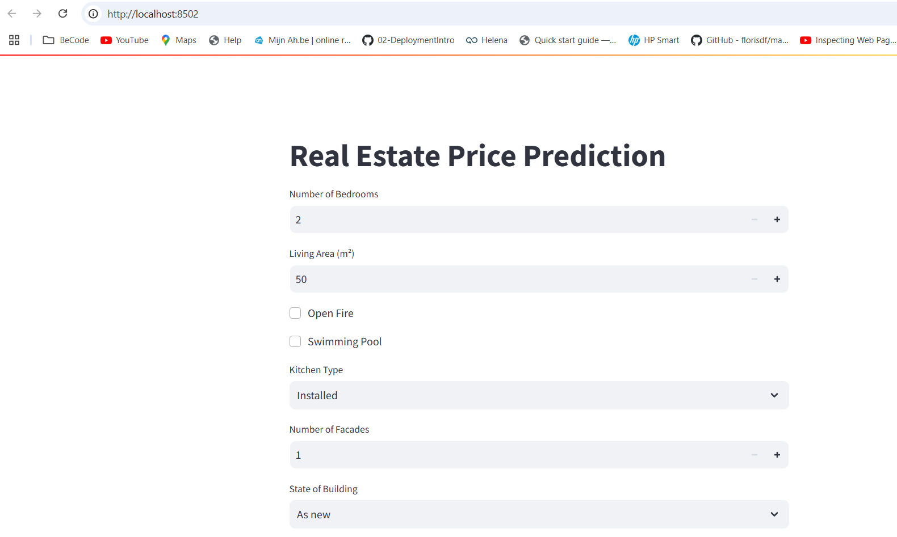
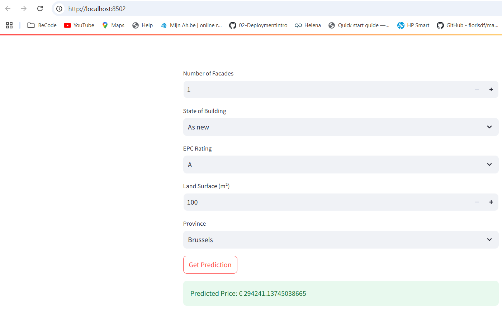

# immo-eliza-deployment

## predict.py (excercise only)
to predict the value from a house, based on a trained CB-model. 
Input taken from input.json,
Output place in output.json.

## app.py
API to predict the value from a house, based on a trained CB-model. 
Input is taken from user input (using pydantic basemodel).

How to run?
    In git bash terminal, enter: "uvicorn api.app:app ".  
    Should show: INFO: "Uvicorn running on http://127.0.0.1:8000 (Press CTRL+C to quit)
    Go in browser to http://127.0.0.1:8000/docs where the API can be tested.

## str.py
Streamlit interface that interacts with app.py.

How to run?
    In cmd terminal: "streamlit run str.py"
    (Make sure app.py is active first.)
    Result: browser is opening.  Attributes can be updated in browser and prediction can be made.
    
    

## next(1) - how to make available to others?  Render - Docker

## test.ipynb : only used for testing.

## next(2) - make simular for polynominal regression model