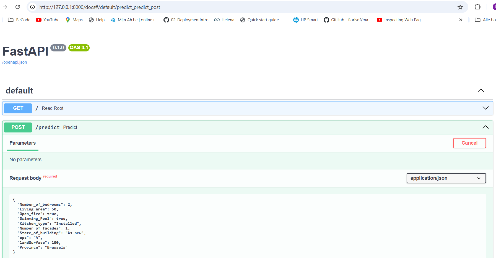
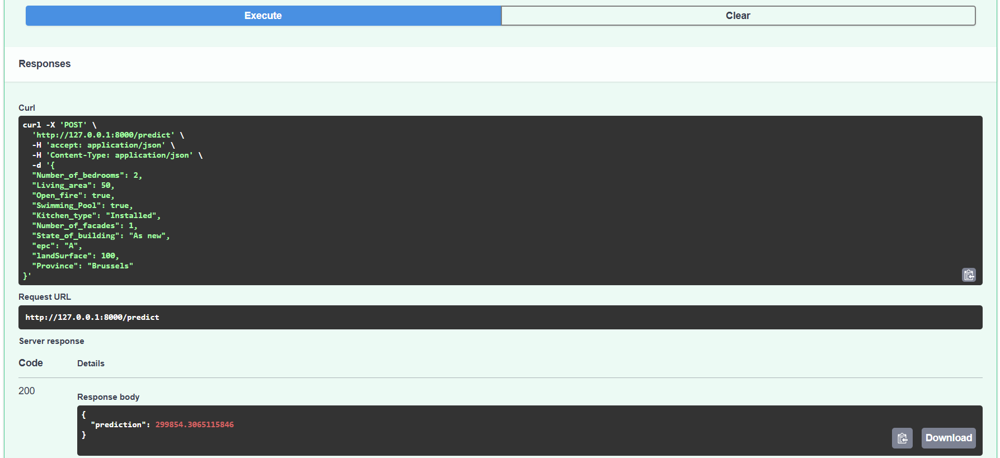
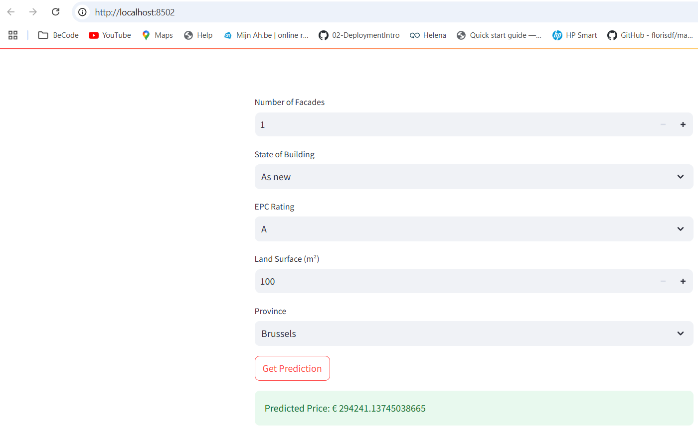

# immo-eliza-deployment

# 🏢 Description
In this project(-step), trained machine learning models to predict prices of Beglian houses, are deployed with API's.
Details on the set up and training steps of the machine learning models, was covered in a previous project step and can be found back here: https://github.com/Pe789/immo-eliza-ml

# 📦 Repo structure 
 
    ├── .venv/
    ├── api/
    │   ├── app.py
    │   ├── app2.py
    │   ├── Dockerfile
    │   └── predict.py
    ├── images/
    ├── streamlit/
    ├── .gitignore
    ├── input.json
    ├── output.json
    ├── README.md
    ├── requirement.txt
    ├── str.py
    └── test.ipynb

# Detail

## predict.py in api-folder (excercise only)
to predict the value from a house, based on a trained CB-model. 
Input taken from input.json,
Output place in output.json.

## app.py in api-folder
API to predict the value from a house, based on a trained CB-model. 
Input is taken from user input (using pydantic basemodel).

How to run?

    - In git bash terminal, enter: "uvicorn api.app:app ".   
    - Should show: INFO: "Uvicorn running on http://127.0.0.1:8000 (Press CTRL+C to quit)  
    - Go in browser to http://127.0.0.1:8000/docs where the API can be tested.

## str.py
Streamlit interface that interacts with app.py.

How to run?

    - In cmd terminal: "streamlit run str.py".  
    - (Make sure app.py is active first.)  
    - Result: browser is opening.   
    - Attributes can be updated in browser and prediction can be made.

# Still under construction:
    *next(1) : how to make available to others?  Render - Docker*
    *next(2) : make simular for polynominal regression in app2.py (under construction)*

*NOTE : test.ipynb : only used for testing.*

# ⏱️ Timeline
This project took 1 week for completion.

# 📌 Personal Situation
This project-step was done as part of the AI Boocamp at BeCode.org. 